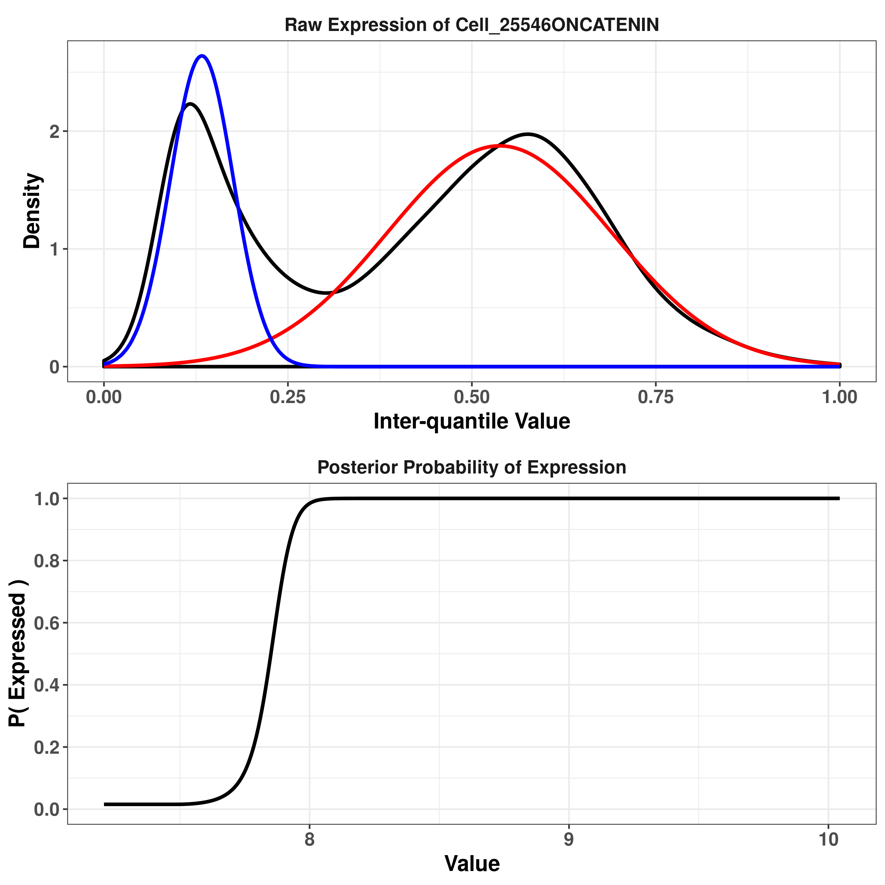

# naivestates - Inference of cell states using Naive Bayes

This work is supported by the *NIH Grant 1U54CA225088: Systems Pharmacology of Therapeutic and Adverse Responses to Immune Checkpoint and Small Molecule Drugs* and by the *NCI grant 1U2CCA233262: Pre-cancer atlases of cutaneous and hematologic origin (PATCH Center)*.

**Contributors:** Artem Sokolov

## Installation

The package can be installed directly from GitHub with the following commands:
``` r
if( !require(devtools) ) install.packages("devtools")
devtools::install_github( "labsyspharm/naivestates" )
```

Once installed, the package can be loaded using the standard `library()` interface. In the remainder of this introduction, we will also make use of several `tidyverse` functions.
``` r
library( naivestates )
library( tidyverse )
```

## Loading the data

The package comes with a small example of 10,000 cells, which is distributed as a stand-alone .csv file. Let's load and examine it:

``` r
fnData <- system.file( "examples/example1_data.csv.gz", package="naivestates" )
X <- read_csv( fnData, col_types=cols() )
# # A tibble: 6 x 45
#   CellId Cell_25546ONHoe… Cell_25546ONA488 Cell_25546ONA555 Cell_25546ONA647
#    <dbl>            <dbl>            <dbl>            <dbl>            <dbl>
# 1    173             9.79             8.26             7.31             7.93
# 2    235             9.57             9.34             8.25             8.42
# 3    345             9.26             8.67             7.52             8.22
# 4    350            10.0              8.23             7.46             7.70
# 5    378            10.8              8.34             7.57             7.66
# 6    392             9.84             8.57             7.59             7.93
# # … with 40 more variables
```

The variable `fnData` will contain the filename of where the data lives on disk (for example, `/home/sokolov/R/x86_64-pc-linux-gnu-library/3.6/naivestates/examples/example1_data.csv.gz`). This file can always be examined directly by other tools and programming languages.

After loading the .csv file, `X` now contains a cell-by-feature data frame consisting of Cell IDs in the first column, followed by marker expression values in subsequent columns. The last few columns also contain spatial characteristics, such as the cell position in the image, as well as its area and perimeter.

### Channel -> Cell Type/State mapping

The Naive Bayes framework requires predefined mapping of channels/markers to cell types/states. Currently, the framework assumes a binary association between the two (e.g., Immune cells express CD45, Stroma cells express SMA, etc.) As these relationships become more refined, future development will include support for probabilistic assignment of markers to cell types.

The package includes an example mapping to go along with the dataset above. As with the data itself, the mapping can be loaded into R or inspected directly by other tools and programming languages.

``` r
fnMap <- system.file( "examples/example1_chnlmap.csv", package="naivestates" )
M <- read_csv( fnMap, col_types=cols() )
# # A tibble: 19 x 2
#    Channel              Class      
#    <chr>                <chr>      
#  1 Cell_25546ONMITF     Tumor      
#  2 Cell_25546ONS100     Tumor      
#  3 Cell_25546ONSMA      Stroma     
#  4 Cell_25546ONVIMENTIN Stroma     
#  5 Cell_25546ONVIMENTIN Mesenchymal
# ...
```

There are several important points to highlight:
1. When composing your own marker-cell type relationships, ensure that the resulting data frame has column names `Channel` and `Class`.
2. Not every channel present in the dataset needs to have a mapping.
3. The same channel may map to multiple classes. For example, VIMENTIN is mapped to Stroma and Mesenchymal classes in the example above.

## Fitting Gaussian Mixture Models

The model fitting is performed by `GMMfit()`, which requires a cell-by-channel data frame, the name (or index) of the column containing Cell IDs, and the list of columns that we want to fit a GMM to. The Cell IDs are used internally to keep track of individual cells. The function returns a data frame that contains the GMM for each (requested) channel as well as the posterior probabilities of whether a given marker is expressed in a given cell:

``` r
Fits <- GMMfit( X, CellId, M$Channel )
# # A tibble: 14 x 3
#    Marker               Values                GMM             
#    <chr>                <list>                <list>          
#  1 Cell_25546ONCATENIN  <tibble [10,000 × 6]> <named list [5]>
#  2 Cell_25546ONCD3      <tibble [10,000 × 6]> <named list [5]>
#  3 Cell_25546ONCD4      <tibble [10,000 × 6]> <named list [5]>
# ...
```

The function also accepts three optional parameters:
* `qq` - which controls inter-quantile range that the model is fit to. This is useful for removing outliers. By default, the model is fit to the [0.001, 0.999] quantile range of each channel.
* `mu_init` - the initial placement of means for the Gaussian mixture, which can be used to guide the underlying EM algorithm. The values are specified relative to the inter-quantile range and default to 0.2 and 0.8.
* `seed` - random seed that allows for full reproducibility of the output

We can inspect the resulting models by hand. For example, here's the first model in the list, which is associated with beta-catenin:

``` r
Fits$GMM[[1]]
# $lambda
# [1] 0.2825191 0.7174809
# 
# $mu
# [1] 0.1330592 0.5376005
# 
# $sigma
# [1] 0.04271679 0.15267999
# 
# $lo
#     0.1% 
# 7.207441 
# 
# $hi
#    99.9% 
# 10.04373 
```

The model consists on the mixture coefficients (lambda), mean placement inside the inter-quantile range (mu) and the associated standard deviations, and the inter-quantile range boundaries in the original expression space.

We can also inspect the posterior probabilities (e.g., `Fits$Values[[1]]`) by hand, but it is usually better to plot the fit. The package provides a function that works directly with the data frame returned by `GMMfit()`. For example, let's examine the fit for beta-catenin:

``` r
plotFit( Fits, "Cell_25546ONCATENIN" )
```



The top panel shows the distribution of raw expression values after they have been mapped to the inter-quantile range (black), the fit of the positive-expression Gaussian (red) and the matching fit of the negative-expression Gaussian (blue). The bottom panel is the matching posterior probability of the marker being expressed, given the original (unmapped) value.

Lastly, it may be desirable to reshape the data frame to the original cell-by-marker format. This can be done by using `GMMreshape()`:

``` r
exprPostProb <- GMMreshape( Fits )
# # A tibble: 10,000 x 15
#    CellId Cell_25546ONCAT… Cell_25546ONCD3 Cell_25546ONCD4 Cell_25546ONCD45
#     <dbl>            <dbl>           <dbl>           <dbl>            <dbl>
#  1    173           0.997           0.0696           0.935            0.110
#  2    235           0.0251          0.307            0.935            0.166
#  3    345           0.0235          0.0698           0.935            0.110
#  4    350           1               0.0750           0.935            0.110
#  5    378           1               0.0880           0.935            0.137
#  6    392           0.0257          0.0696           0.823            0.110
#  7    400           0.0191          0.0858           0.922            0.112
#  8    457           1               0.334            0.935            0.246
#  9    582           0.973           0.806            0.935            0.992
# 10    671           1               0.442            0.935            0.199
# # … with 9,990 more rows, and 10 more variables: Cell_25546ONCD45RO <dbl>,
# #   Cell_25546ONCD8 <dbl>, Cell_25546ONECAD <dbl>, Cell_25546ONFOXP3 <dbl>,
# #   Cell_25546ONKERATIN <dbl>, Cell_25546ONMITF <dbl>, Cell_25546ONPD1 <dbl>,
# #   Cell_25546ONS100 <dbl>, Cell_25546ONSMA <dbl>, Cell_25546ONVIMENTIN <dbl>
```

## Inferring cell type / state

The posterior probabilities of marker expression can now be combined in a Naive Bayes fashion to produce the final cell type/state calls. First, we define the classification task of interest. For example, we might be interested in distinguishing immune, tumor and stromal cells:

``` r
task <- c("Immune", "Tumor", "Stroma")
```

The channel expression probabilities can now be passed to `taskPostProb()` along with a channel -> class mapping and the name of a column that contains cell IDs:

``` r
Res <- taskPostProb( exprPostProb, CellId, M, task )
# # A tibble: 10,000 x 5
#    CellId Immune  Stroma Tumor Call  
#     <dbl>  <dbl>   <dbl> <dbl> <chr> 
#  1    173  -31.9  -16.1  -17.4 Stroma
#  2    235  -24.7  -10.9  -18.0 Stroma
#  3    345  -28.6  -10.4  -25.6 Stroma
#  4    350 -Inf   -Inf    -23.4 Tumor 
#  5    378 -Inf   -Inf    -22.9 Tumor 
# # … with 9,995 more rows
```

The final output contains log of posterior probability for each class in the classification task, as well as the final argmax call for each cell. Note that no call is made, when all posterior probabilities are zero:

``` r
filter( Res, is.na(Call) )
# # A tibble: 120 x 5
#    CellId Immune Stroma Tumor Call 
#     <dbl>  <dbl>  <dbl> <dbl> <chr>
#  1  30109   -Inf   -Inf  -Inf NA   
#  2  31651   -Inf   -Inf  -Inf NA   
#  3  35768   -Inf   -Inf  -Inf NA   
#  4  36805   -Inf   -Inf  -Inf NA   
#  5  36954   -Inf   -Inf  -Inf NA   
# # … with 115 more rows
```
